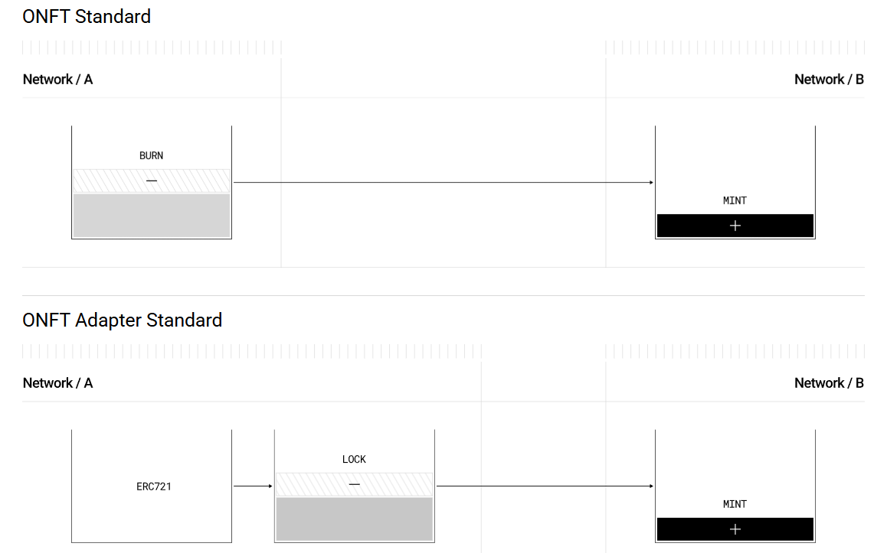
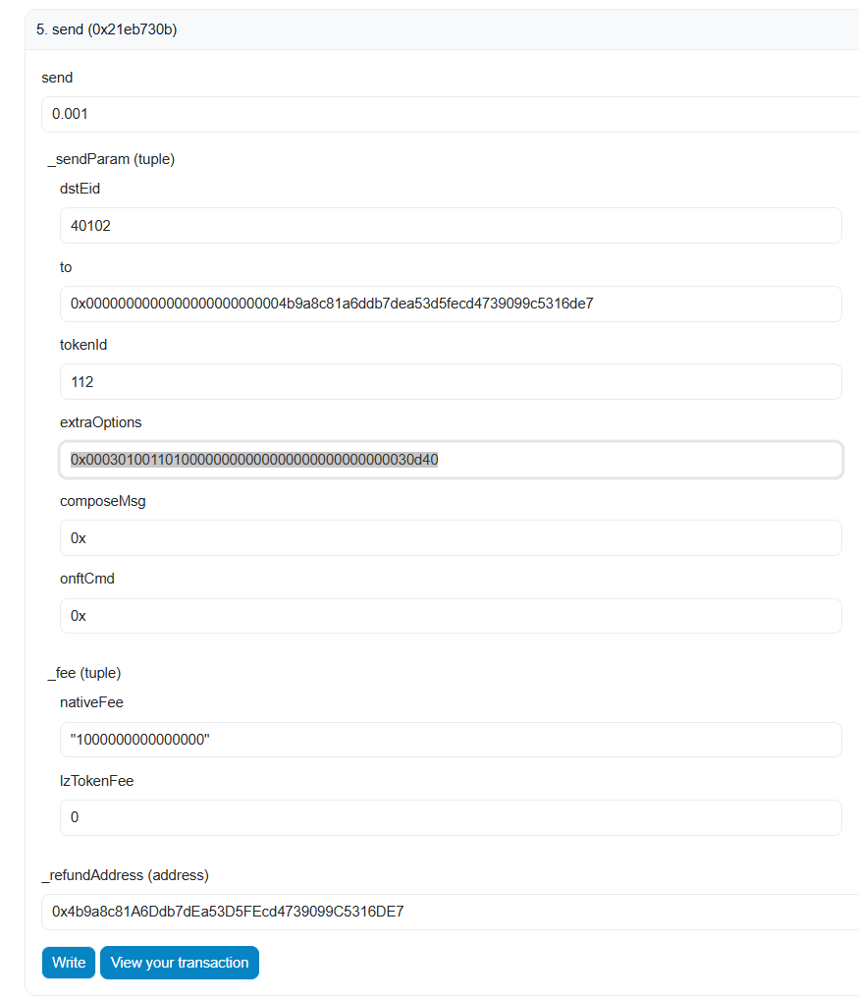

# 跨链
`cross-chain` 的关键技术
- 基于监听的合约事件执行操作,保证资产的一致性，确保多链上同时刻参与流动的资产是固定的
- 针对已有的资产（`ERC20/NFT`）
  - 一般在源头链上执行 `lock/unlock`, 对应的在目标链上执行 `mint/burn`
  - 要求源头链上部署和资产对应的锁仓管理合约
  - 要求目标链上部署相同 `Metadata` 的资产合约
- 针对未部署的资产
  - 一般在源头链上执行 `burn/mint`, 对应的在目标链上执行 `mint/burn`
  - 要求源头链和目标链都是相同源数据的资产合约
## LayerZero
[LayerZero](https://docs.layerzero.network/v2/developers/evm/onft/quickstart) 支持大多数链资产的跨链，针对已有和新资产，提供两种不同的合约模板：

### 链上资产跨链
针对链上现行资产的跨链，采用的是第二种方案
- 源头链上执行资产的转移，变相的进行资产锁仓
  - 用户在跨链前，需要先授权跨链相关的锁仓合约
- 目标链上部署新的合约，在监听/验证目标链的锁仓行为后，执行新资产的 `mint/burn`
```solidity
    function _debit(address _from, uint256 _tokenId, uint32 /*_dstEid*/) internal virtual override {
        // @dev Dont need to check onERC721Received() when moving into this contract, ie. no 'safeTransferFrom' required
        innerToken.transferFrom(_from, address(this), _tokenId);
    }

    function _credit(address _toAddress, uint256 _tokenId, uint32 /*_srcEid*/) internal virtual override {
        // @dev Do not need to check onERC721Received() when moving out of this contract, ie. no 'safeTransferFrom'
        // required
        // @dev The default implementation does not implement IERC721Receiver as 'safeTransferFrom' is not used.
        // @dev If IERC721Receiver is required, ensure proper re-entrancy protection is implemented.
        innerToken.transferFrom(address(this), _toAddress, _tokenId);
    }
```
#### Endpoint
`LayerZero` 使用 `endpoint` 合约处理数据资产并抛出事件，每个 `endpoint` 合约有自己对应 `EID`

在资产跨链时，通过 `EID` 指明目标链
### Solidity Examples
1. `token`：目前链上的资产
2. `lzEndpoint`：源头链上的 `endpoint` 合约地址
3. `delegate`：当前合约的 `Owner` 地址，拥有合约配置的权限
```solidity
// SPDX-License-Identifier: UNLICENSED
pragma solidity ^0.8.22;

import {ONFT721Adapter} from "@layerzerolabs/onft-evm/contracts/onft721/ONFT721Adapter.sol";

contract MyONFT721Adapter is ONFT721Adapter {
    constructor(
        address _token,
        address _lzEndpoint,
        address _delegate
    ) ONFT721Adapter(_token, _lzEndpoint, _delegate) {}

}
```
目标链上的合约模板
1. `name，symbol`: 目标链上的资产源数据
2. `lzEndpoint`：目标链上的 `endpoint` 合约地址
3. `delegate`：目标链上资产合约的 `Owner` 地址
```solidity
// SPDX-License-Identifier: UNLICENSED
pragma solidity ^0.8.22;

import { ONFT721 } from "@layerzerolabs/onft-evm/contracts/onft721/ONFT721.sol";

contract MyONFT721 is ONFT721 {
    constructor(
        string memory _name,
        string memory _symbol,
        address _lzEndpoint,
        address _delegate
    ) ONFT721(_name,_symbol, _lzEndpoint, _delegate) {}
}
```
#### setPeers
`LayerZero` 通过 `mapping(uint32 eid => bytes32 peer) public peers;` 表示数据跨链的方向和目标链上的资产合约

以 `Ethereum Sepolia （EID=40161）` 跨链 `BNB Testnet（EID=40102）` 为例：

1. 部署合约

`Ethereum Sepolia` 部署合约：`0x344A9255734131B5C6A15008C0126C7df1490BC9`

`BNB Testnet` 部署合约：`0xe1a4FE17Ae8bAF72DBC8faf755D3B446bf8fc553`

2. 在双边合约中设置对方资产合约地址

在 `Ethereum Sepolia` 合约中执行 `setPeer(uint32 _eid, bytes32 _peer)` 函数，传参为 `BNB Testnet` 链上参数`（40102，0xe1a4FE17Ae8bAF72DBC8faf755D3B446bf8fc553）`

在 `BNB Testnet `合约中执行 `setPeer(uint32 _eid, bytes32 _peer)` 函数，传参为  `Ethereum sepolia` 链上参数`（40162，0x344A9255734131B5C6A15008C0126C7df1490BC9)`

3. 资产跨链
```json
struct SendParam {
    uint32 dstEid; // 目标链上的EID，用来表明当前资产的跨链方向以及通过第二步的操作获取目标链上的资产合约地址.
    bytes32 to; // 跨链资产在目标链上的接收地址.
    uint256 tokenId; // 跨链资产的ID，要求先授权源头链的资产操作合约
    bytes extraOptions; // 指定链下事件处理的配置 0x00030100110100000000000000000000000000030d40.
    bytes composeMsg;
    bytes onftCmd; 
}
struct MessagingFee {
  uint256 nativeFee; // 此次跨链付出的 NativeToken的数量，必须等于 msg.value,剩余资产会退还
  uint256 lzTokenFee; // 使用ERC20付款
}
```

`Ethereum Sepolia` 跨链 `hash` `https://sepolia.etherscan.io/tx/0x62173513e0abdceb79dab9c0de0677387200d3a78f565f188851c854d5e3931d`
`LayerZero Scan` 确认跨链交易状态  `https://testnet.layerzeroscan.com/tx/0xa272be8135d24b25a610319be262b275479c6404173e3a11a494f835277caf6f`
